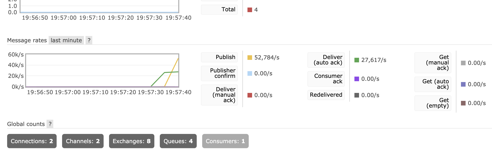
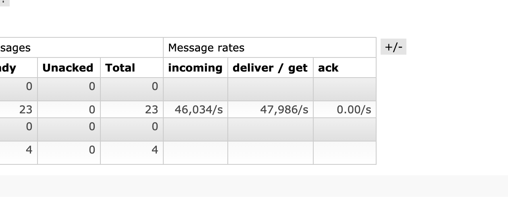

# go-samples
Example of using golang

- [tcp proxy](./proxy/tcpproxy)
- TCP is a moresophisticated transport protocol is one that offers a reliable, connection oriented byte stream service. Such a service has proven useful to a wide assortment of application because it frees the application from having to worry about missing or reordered data.

### rabbitmq
Specifically we looked at:
1. No confirms, no acks
2. Single docker

Benchmark #1: 1 publishers, 50k msgs/s per publisher, 1 queues, 1 consumers

### links
- [crud mongodb](https://medium.com/@kumar16.pawan/creating-a-crud-application-using-go-and-mongodb-cc077ce2d0e)
- [rabbitmq](https://www.rabbitmq.com/tutorials/tutorial-one-go.html)
